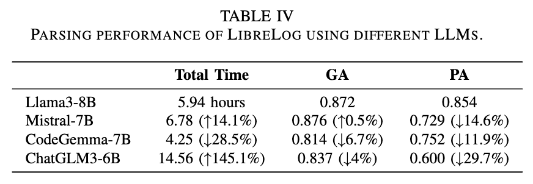

# LibreLog: Accurate and Efficient Unsupervised Log Parsing Using Open-Source Large Language Models

This repo is the package for [ICSE2025] "LibreLog: Accurate and Efficient Unsupervised Log Parsing Using Open-Source Large Language Models"

## Overall workflow of LibreLog

<p align="center"></p>


## Structure
We present LibreLog repository structure below.

```
.
├── README.md
├── docs
│   └── work_flow.pdf
├── evaluation
│   ├── RQ1
│   │   └── RQ1.png
│   ├── RQ2
│   │   └── RQ2.png
│   ├── RQ3
│   │   ├── RQ3_1.png
│   │   └── RQ3_2.pdf
│   └── RQ4
│       └── RQ4.png
├── full_dataset
│   └── README.md
├── models
│   └── README.md
├── parser
│   ├── accuracy.py
│   ├── evaluator.py
│   ├── grouping.py
│   ├── llama_parser.py
│   └── regex_manager.py
├── parsing.sh
├── requirements.txt
└── results
    ├── AEL.csv
    ├── Drain.csv
    ├── LILAC.csv
    ├── LLMParsert5base.csv
    └── LibreLog.csv
```


## Requirement 

```shell
pip install -r requirements.txt
```

## Models download

Please download the base LLM (Meta-Llama-3-8B-Instruct) from [Huggingface](https://huggingface.co/meta-llama/Meta-Llama-3-8B-Instruct).


## Datasets download

Please first download the full datasets of Loghub-2.0 via [Zenodo](https://zenodo.org/record/8275861).


## Parsing

Please run the following command to run LibreLog.
```shell
sh parsing.sh
```


## Evaluation Results
### RQ1: What is the effectiveness of LibreLog?
<p align="center"></p>

### RQ2: What is the efficiency of LibreLog?
<p align="center"></p>

### RQ3: How does different settings impact the result of LibreLog?
<p align="center"></p>
<p align="center"></p>

### RQ4: What is the effectiveness of LibreLog with different LLMs?
<p align="center"></p>